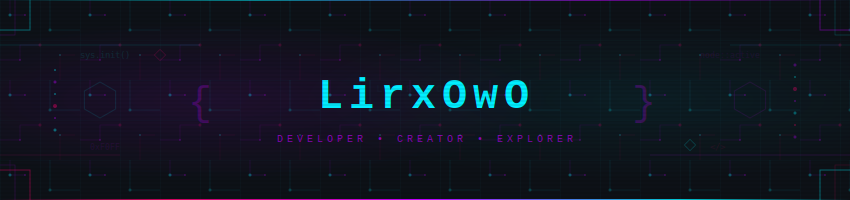

 

 

<!-- ═══════════════════════════════════════ -->

<h2 align="center">🔧 我在用的东西</h2>

<table>
<tr><td align="center" width="50%">

**写代码用**

</td><td align="center" width="50%">

**搭配干活**

</td></tr>
</table>

<!-- ═══════════════════════════════════════ -->

<h2 align="center">📊 GitHub 数据</h2>

  

 

<!-- ═══════════════════════════════════════ -->

<h2 align="center">🏆 成就</h2>

<!-- ═══════════════════════════════════════ -->

<h2 align="center">🐍 贡献</h2>

<picture>
  <source media="(prefers-color-scheme: dark)" srcset="https://raw.githubusercontent.com/xiaoliziawa/xiaoliziawa/output/github-contribution-grid-snake-dark.svg" />
  <source media="(prefers-color-scheme: light)" srcset="https://raw.githubusercontent.com/xiaoliziawa/xiaoliziawa/output/github-contribution-grid-snake.svg" />
  
</picture>

 

